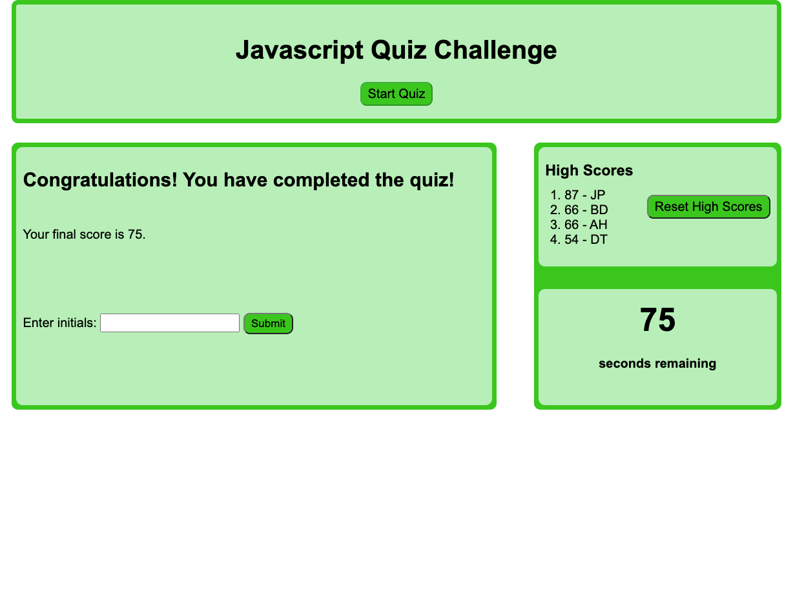

# Javascript-Quiz

Javascript Quiz exercise

* index.html provides the framework for the quiz page with a header containing the start button, a section for the questions as well as dialog, and a sidebar for high scores and timer.
* style.css for the initial styling of the page
* script.js contains the Javascript code for the quiz
    * Upon page load, any high scores saved on local storage are loaded and displayed
    * Reset button resets the high scores
    * Start button starts the quiz and the timer
    * For each question, 4 buttons are presented, with one of them being the right answer
    * Clicking on the wrong answer will deduct 10 seconds from the timer
    * Clicking on the right answer will allow the user to advance to the next question
    * If the user answers all 5 questions correctly before time runs out, user is presented with a form to submit their initials
    * If the score was within the top 5 best scores, the score will be displayed on the right

[Link to the site] (https://jsp220.github.io/Javascript-Quiz/)

